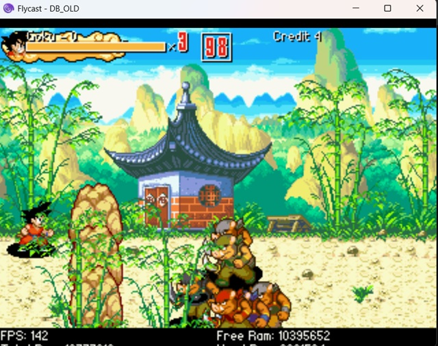
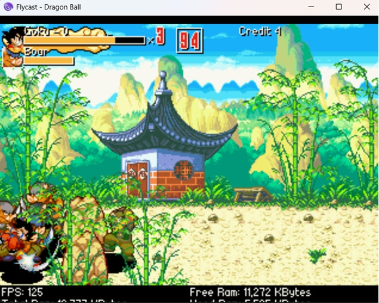

# OpenBOR Engine for Sega Dreamcast (Modern GCC 13+ Updated)

[OpenBOR](http://www.chronocrash.com/) is a royalty-free sprite-based side-scrolling gaming engine, based on the source code of the [Beats of Rage](https://en.wikipedia.org/wiki/Beats_of_Rage) game published by [Senile Team](http://www.senileteam.com) back in 2004. 

The `v3.0 Build 4111` release of the official source code was the **last source code revision supporting the Sega Dreamcast platform**. Starting from that release, Sega Dreamcast support was officially dropped. 

**This repository (NaiSan89's fork) breathes new life into the legacy Dreamcast port.** The goal is to fully modernize the engine to compile cleanly on today's strict compilers (GCC 13+) and the latest KallistiOS (KOS) environment, while also pushing for new performance and memory optimizations.

---

## 🚀 Features & Updates in this Fork

- **Modern Compiler Compatibility:** Fixed widespread `-fno-common` "multiple definition" linking errors (`paklist`, `anim_list`, `model_cache`, etc.) that prevented the legacy code from compiling on modern GCC toolchains.
- **KallistiOS Integration:** Fully builds against modern KOS v2.0.0+ along with updated Dreamcast ports of `SDL` and `libtremor` (integer-based OGG decoding for better SH4 CPU performance).
- **AICA Hardware Sound Effects:** Compatible PCM8, PCM16, and 4-bit Yamaha ADPCM effects are uploaded to the Dreamcast sound RAM and played directly by AICA hardware channels.
- **Reduced Main RAM and CPU Usage:** After a sound effect is uploaded, its source buffer is released from the Dreamcast's 16 MB main RAM. Volume, panning, playback rate, and looping are handled by the AICA.
- **Python PAK Utilities:** Safe Python 3 tools are included for extracting and rebuilding OpenBOR `BOR.PAK` archives without requiring the legacy native utilities.

### AICA sound path and memory usage

The Dreamcast port now uses two audio paths:

- Sound effects are cached in the AICA's 2 MB sound RAM and played by hardware whenever possible.
- Music is still decoded by OpenBOR and sent to the AICA as a stream.
- PCM effects that are too long or cannot be cached remain available to the software mixer as a fallback.
- PCM8 WAV files are unsigned, so the engine converts them to signed PCM8 when uploading them to the AICA. Without this conversion, effects sound harsh and voices become difficult to understand.

Approximate mono sound RAM usage:

| Format | Bytes per sample | Usage at 32 kHz |
| --- | ---: | ---: |
| Yamaha ADPCM | 0.5 | 16 KB/s |
| PCM8 | 1 | 32 KB/s |
| PCM16 | 2 | 64 KB/s |

An individual AICA sound effect is limited to 65,534 samples. This corresponds to approximately 2.05 seconds at 32 kHz, 2.97 seconds at 22.05 kHz, or 1.49 seconds at 44.1 kHz. Long voices should remain PCM for software fallback, be trimmed, or use a lower sample rate instead of being converted blindly to 32 kHz ADPCM.

### Memory usage comparison

The screenshots below show the free main RAM reported by the same game before and after the memory and AICA sound-effect optimizations:

| Before | After |
| :---: | :---: |
|  |  |
| Original memory usage | More free main RAM after the optimizations |

## 🗺️ Roadmap: The Future

- [x] **Toolchain Modernization:** Make the engine compile out-of-the-box on GCC 13+ and modern KOS.
- [ ] **Memory Management Overhaul:** The Sega Dreamcast is strictly limited to 16MB of main RAM. The primary upcoming goal for this fork is to profile memory usage, eliminate RAM leaks, and optimize asset loading to prevent out-of-memory crashes on larger `.pak` files.
- [ ] **Performance Tuning:** Leverage the SH4 FPU and modern GCC optimization flags to hit stable framerates even with heavy action on screen.

---

## 🛠️ Compiling

You will need a working [KallistiOS](http://gamedev.allusion.net/softprj/kos/) `2.0.0+` environment installed on your machine.

1. Open your terminal and clone this repository:
   ```bash
   git clone https://github.com/NaiSan89/OpenBor-DC---Updated.git
   cd OpenBor-DC---Updated/engine
   ```

2. Clean any legacy object files and load the KallistiOS environment:
   ```bash
   make clean
   find . -name "*.o" -delete
   . /opt/toolchains/dc/kos/environ.sh
   ```

3. Build the Dreamcast executable:
   ```bash
   make BUILD_DC=1
   ```

If successful, `OpenBOR.bin` will be generated in the `engine` directory.

The Dreamcast build also scrambles it automatically and produces the final `engine/1ST_READ.BIN`.

---

## 📦 Extracting and Rebuilding BOR.PAK with Python

The scripts require Python 3 and are located in `tools/borpak`:

- `unpack_pak.py` extracts or lists an OpenBOR PAK.
- `pack_bor_pak.py` always packages the current `data` directory as `BOR.PAK`.

Run the scripts from a separate working directory containing the game PAK. The extractor always writes to a `data` directory in the current working directory, and the packer always reads `data` and writes `BOR.PAK` there.

### Extract a PAK

Copy `unpack_pak.py`, `pack_bor_pak.py`, and the original `BOR.PAK` into the working directory, then run:

```bat
python unpack_pak.py BOR.PAK
```

Useful extraction options:

```bat
python unpack_pak.py --list BOR.PAK
python unpack_pak.py --lowercase BOR.PAK
python unpack_pak.py --overwrite BOR.PAK
```

- `--list` only lists the archive contents.
- `--lowercase` converts extracted paths to lowercase.
- `--overwrite` or `-f` replaces files already present under `data`.
- If no PAK name is supplied, the script looks for `BOR.PAK` and then `bor.pak`.

The extractor validates the PAK header, offsets, sizes, and output paths. Archived paths beginning with `data/` are normalized so extraction does not create `data/data/...`.

### Rebuild BOR.PAK

Keep a backup of the original PAK, edit the extracted `data` directory, and run:

```bat
ren BOR.PAK BOR-original.PAK
python pack_bor_pak.py
```

If `BOR.PAK` already exists and you deliberately want to replace it:

```bat
python pack_bor_pak.py --force
```

The packer recursively includes every regular file below `data`, stores paths in the OpenBOR `data\...` format, rejects symbolic links and case-insensitive duplicate paths, and writes the new archive atomically. Internal paths may contain at most 79 UTF-8 bytes, matching the engine format.

### Convert sound effects to Yamaha ADPCM

Always convert from the original WAV files. Use a separate output directory so an already compressed `_dc.wav` or ADPCM file is never compressed again.

From a Windows Command Prompt in the PAK working directory:

```bat
mkdir data\sounds_dc
for %f in (data\sounds\*.wav) do ffmpeg -y -i "%f" -map_metadata -1 -af "lowpass=f=14000" -ac 1 -ar 32000 -c:a adpcm_yamaha -trellis 10 "data\sounds_dc\%~nxf"
```

After listening to the converted files, replace only the intended effects:

```bat
copy /Y data\sounds_dc\*.wav data\sounds\
```

When placing the command inside a `.bat` file, use `%%f` and `%%~nxf` instead of `%f` and `%~nxf`.

The conversion settings are:

- `lowpass=f=14000`: removes frequencies that compress poorly at the target rate.
- `-ac 1`: converts to mono, halving sound RAM use.
- `-ar 32000`: balances clarity, memory use, and maximum effect duration.
- `adpcm_yamaha`: produces the native 4-bit format decoded by the AICA.
- `-trellis 10`: spends more conversion time finding a lower-error ADPCM encoding; it does not add runtime cost on the Dreamcast.

Yamaha ADPCM is lossy. Keep important or long voice samples as PCM if ADPCM artifacts are unacceptable or if they exceed the AICA sample limit.

---

## 🎮 Usage & Generating the Boot Disc

To run the engine on real hardware or an emulator (like Flycast or Demul), use the scrambled `1ST_READ.BIN` generated automatically by `make BUILD_DC=1` and bundle it with a compatible `BOR.PAK` game data file.

1. **Optional manual scramble:** If you have rebuilt only `OpenBOR.bin`, generate `1ST_READ.BIN` manually:
   ```bash
   scramble OpenBOR.bin 1ST_READ.BIN
   # (Note: Use $KOS_BASE/utils/scramble/scramble if it is not in your global PATH)
   ```

2. **Create the Disc Structure:**
   - Create a `cd_root` directory.
   - Place your newly scrambled `1ST_READ.BIN` inside `cd_root`.
   - Place your game's `Paks/BOR.PAK` inside `cd_root`.

3. **Generate the CDI image:**
   Use your preferred Dreamcast homebrew tools (like `mkisofs` and `cdi4dc`, or DreamSDK) to inject an `IP.BIN` and generate the final `.cdi` image for burning or emulation.

---

## 🙏 Credits

- **NaiSan89:** GCC 13+ modernization, KOS toolchain fixes, and memory management optimizations.
- The whole **OpenBOR Team** (Damon Caskey, Plombo, uTunnels, and many more) for building the ultimate 2D engine.
- **Senile Team** (Roel, Jeroen, Sander, Ben) for creating the original Beats of Rage.
- **Neill Corlett** for the original Dreamcast port.
- **SiZiOUS** for the previous iterations of Dreamcast compatibility fixes.
